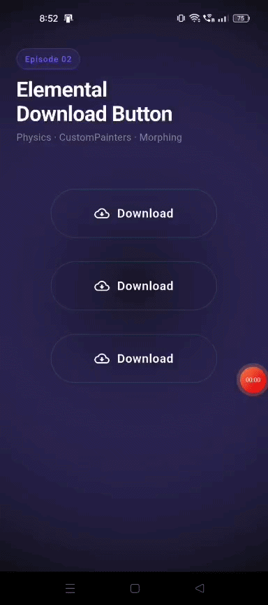

# Flutter Button Animations Showcase 🚀

A curated collection of interactive, production-ready button animations built entirely with the Flutter SDK. 

The focus of this project is on advanced animation techniques using `AnimationController`, `CustomPainter`, Matrix transforms, custom shaders, and physics-inspired motion—without relying on any third-party animation packages.

## 📱 Preview

| Morphing Share Button | Elemental Download Button |
|:---:|:---:|
|  |  |

---

## 🎯 Project Goals

- Showcase advanced **Flutter animations** and **Flutter UI** design.
- Explore micro-interactions and physics-driven motion.
- Learn and demonstrate complex **Flutter animation examples** in public.
- Build reusable, high-performance animation patterns for the community.

## 🎬 Current Episodes

This repository is structured as an ongoing series of "Episodes." Each episode focuses on a unique interaction design.

### Episode 01: The Morphing Share Button
A highly kinetic share button demonstrating complex state choreography and gesture-driven interactions.
- **The Morph**: Shrinks from a pill into a central hub.
- **The Bubble Break**: 4 social platform bubbles slide out into an arc using `easeOutBack` spring physics.
- **The Vacuum & Drop**: Selecting an icon vacuums rejected bubbles back and drops the chosen icon into a checkmark morph.

### Episode 02: Elemental Download Button
A physics-driven download button featuring fluid dynamics and **CustomPainter** rendering.
- **The Elements**: Three distinct physics themes—Water, Fire, and Toxic Sludge.
- **The "Wetting" Border**: A dynamic gradient shader instantly colorizes the container border exactly where the liquid touches it.
- **Surface Reflection**: A semi-transparent wet gloss trace travels along the highest peaks of the sine waves.
- **Physical Feedback**: Features non-linear download stuttering (`TweenSequence`), pressure expansion, and final settling inertia.

### Coming Soon
- Magnetic Hover Button
- Particle Burst Button
- 3D Flip Button

---

## 🧠 What You Will Learn

This repository demonstrates practical **Flutter motion design** techniques such as:
- `AnimationController` orchestration
- Staggered animations
- `CustomPainter` and `CustomClipper`
- Matrix transforms and 3D effects
- `TweenSequence` for non-linear motion
- Physics-inspired motion (springs, inertia)
- Canvas drawing and Shaders
- Gesture-driven interactions

---

## ✨ Architecture & Performance

*   **Zero External Dependencies**: Built strictly using the core Flutter SDK.
*   **Feature-First Structure**: Animation logic, painters, widgets, and reusable components are separated for maintainability.
*   **Hardware Accelerated**: Uses GPU-friendly transforms (`Transform.translate`, `Transform.scale`) where appropriate to keep animations efficient.

### Repository Structure
```text
lib/
 ├── core/              # Constants, colors, and themes
 ├── features/          # The Episodes (each isolated)
 │   ├── morphing_share_button/
 │   │   ├── animations/
 │   │   ├── widgets/
 │   │   └── screen/
 │   └── liquid_fill_button/
 ├── shared/            # Common widgets like the HomeScreen
 └── main.dart
```

---

## 🛠️ Built With

*   **Flutter** & **Dart**
*   `AnimationController` & `CurvedAnimation`
*   `CustomPainter` & Canvas API
*   `TweenSequence`

## 🚀 How to Run

1. Clone the repository:
   ```bash
   git clone https://github.com/shahtushar-dev/flutter_button_animations.git
   ```
2. Navigate to the directory:
   ```bash
   cd flutter_button_animations
   ```
3. Get the dependencies:
   ```bash
   flutter pub get
   ```
4. Run the app:
   ```bash
   flutter run
   ```

---

## 🤝 Contributing

Feel free to explore the source code, reuse ideas in your own projects, or contribute new animation concepts through pull requests. Whether you want to improve **Flutter custom widgets**, add new **Flutter micro interactions**, or optimize existing effects, all contributions are welcome!

---
*Built with ❤️ for the Flutter Community.*
