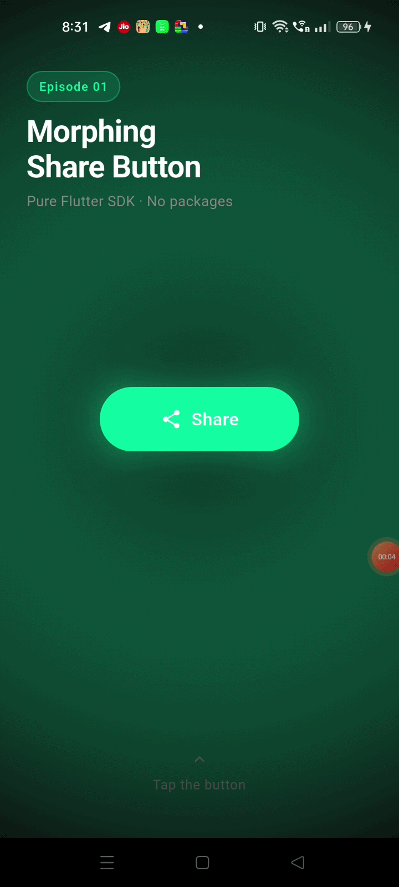

# Flutter Button Animations Showcase 🚀

A curated collection of highly interactive, premium, and liquid-smooth button animations built entirely with the **Pure Flutter SDK**. 

No third-party animation packages. No bloated dependencies. Just math, canvas, and Flutter's built-in animation controllers running at a flawless 60/120fps.



---

## 🎬 The Episodes
This repository is structured as an ongoing series of "Episodes." Each episode focuses on a unique, production-ready interaction design.

### Episode 01: The Morphing Share Button (Current)
A highly kinetic share button that demonstrates complex physics and state choreography.
- **The Morph**: Shrinks from a pill into a central hub.
- **The Bubble Break**: 4 social platform bubbles (Facebook, WhatsApp, Twitter, LinkedIn) slide out from behind the center into a perfect top-arc using `easeOutBack` spring physics.
- **The Vacuum & Drop**: Selecting an icon instantly vacuums the rejected bubbles back into the center. The chosen icon then drops into the hub, seamlessly morphing the hub into a confirmation checkmark.

### Episode 02: Coming Soon...

---

## ✨ Features & Architecture

*   **Zero Dependencies**: Relies exclusively on `AnimationController`, `CustomPaint`, `Transform`, and `Stack`.
*   **Feature-First Architecture**: Code is beautifully organized by feature, separating animations, widgets, and state logic for maximum readability.
*   **Hardware Accelerated**: Uses `Transform.translate` and `Transform.scale` to ensure the GPU handles the heavy lifting, preventing jank.
*   **Custom Physics**: Carefully tuned stagger delays and custom `Interval` curves create organic, liquid-feeling movements.

---

## 🛠️ How to Run

1. Clone the repository:
   ```bash
   git clone https://github.com/shahtushar-dev/flutter_button_animations.git
   ```
2. Navigate to the directory:
   ```bash
   cd flutter_button_animations
   ```
3. Get the dependencies (just the standard Flutter SDK):
   ```bash
   flutter pub get
   ```
4. Run the app:
   ```bash
   flutter run
   ```

---

## 📺 Media & Tutorials
Watch the short videos documenting the creation and visual feel of these animations:
*   [YouTube Shorts Channel](https://www.youtube.com/@codeinmotionlabs/shorts)

---

## 🤝 Contributing
Feel free to fork this repository, study the animation math, and use these widgets in your own production apps! If you have ideas for new button animations, open an issue or submit a PR.

---
*Built with ❤️ for the Flutter Community.*
